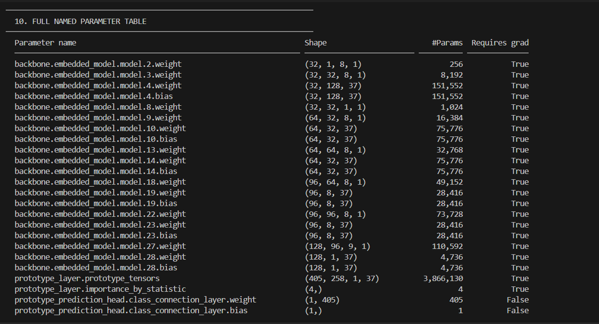
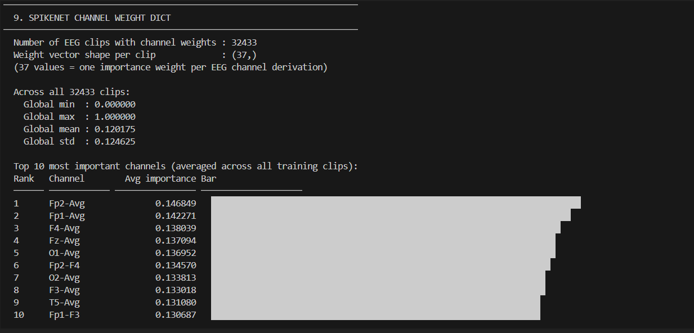
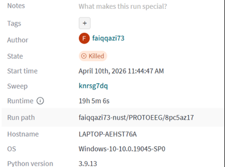

````markdown


If you’ve ever looked at EEG data, you know that finding IEDs (spikes) is like finding a needle in a haystack. Even senior neurologists often disagree on whether a wave is a real spike or just background noise. Most AI models try to help, but they are "Black Boxes" they give you a prediction but don't explain why. Doctors, quite rightly, don't trust a machine's "Yes/No" when it comes to diagnosing epilepsy.
This project fixes that by using Case-Based Reasoning. Instead of just giving a probability score, It identifies a wave and tells the doctor: "I think this is a spike because it looks exactly like these 10 historical cases from our database."
How it reasons:
Morphology (Shape): The model captures the actual structure of the wave (the "latent" features).
Spatial Distribution (Location): Unlike older models that look at just one channel, this model looks at the whole head. It uses Channel Masking to figure out which part of the brain is actually showing the activity.
Interpretable Stats (ISFs): To make the "similarity" more medical, we didn't just use deep learning features; we forced the model to look at Range, Variance, and FFT (Frequency).
The kNN Twist: We train the model to "understand" EEG space, and then we use a k-Nearest Neighbors approach so that the model can find matches even for very rare or weird-looking spikes.

---

# 1. Prerequisite: The Environment

We used **Python 3.9.13** for this. Please stick to this version to avoid dependency hell.

---

## Setting up the Virtual Environment

```powershell
cd ProtoEEG
python -m venv venv

# Activate it (Windows)
.\venv\Scripts\Activate.ps1
```

---

## Installing Dependencies

First install the main requirements.

We have two requirement files because of the legacy SpikeNet components.

```powershell
pip install -r requirements.txt
pip install -r spikenet_requirements.txt
```

---

## Important: Fix the PyTorch Version

If you are using a GPU (**highly recommended for training**), you need the specific **CUDA 11.7 build (CU117)**.

Otherwise PyTorch may silently install the CPU version and training will become painfully slow.

Run:

```powershell
pip uninstall -y torch torchvision torchaudio

pip install --index-url https://download.pytorch.org/whl/cu117 `
torch==1.13.1+cu117 `
torchvision==0.14.1+cu117 `
torchaudio==0.13.1
```

---

# 2. Required Data Files (Manual Placement)

Large files are not included in Git.

You must manually place them at the exact paths below otherwise scripts will crash with file-not-found errors.

| Path | File | Description |
|---|---|---|
| `../sn2_data/organized_data/` | `train_dict.pth` etc. | Training / Validation / Test EEG dictionaries and labels (`.npy`) |
| `ProtoEEG/models/` | `trained_model.pth` | Pre-trained model weights |
| `ProtoEEG/model_feats/` | `spikenet_labels.pth` | Pre-calculated channel weights dictionary |
| `ProtoEEG/sample_data/` | `sample_data.pth` | Small subset for quick testing / demos |


---

# 3. Data Preparation (NMT Dataset)

If you have the raw NMT EDF files and CSV annotations, run the script below to convert them into the format expected by the model.

```powershell
python nmt_to_proto.py `
  --edf-dir "E:\NMT-Events\Data\raw_data\edf\Abnormal EDF Files" `
  --csv-dir "E:\NMT-Events\Data\raw_data\csv\SW & SSW CSV Files" `
  --output-dir "..\sn2_data\organized_data" `
  --target-fs 128 `
  --window-samples 192 `
  --step-samples 192 `
  --train-ratio 0.8 `
  --val-ratio 0.1 `
  --normal-keep-prob 0.2
```

---





# 4. Running the Code

---

## Generate SpikeNet Labels

This pre-calculates the importance of each EEG channel.

```powershell
python create_spikenet_labels.py
```

---

## Run Local Analysis (Visualization)

This creates the **Local Analysis** plots (similar to Figure 4 in the paper).

It shows:
- EEG topoplots
- nearest-neighbor examples
- prototype comparisons

```powershell
python viz_local_analysis.py
```

---

## Evaluation

To evaluate AUROC and Accuracy on validation/test sets:

```powershell
python eval_eegprotopnet.py -path ./models/trained_model.pth -topk 10
```

---

# 5. Training and W&B Sweeps

We use Weights & Biases (W&B) for experiment tracking and hyperparameter sweeps.

---




## Standard Training

```powershell
python start_train.py
```

---

## Running a Sweep (Hyperparameter Tuning)

If you want to run sweeps similar to those used in the MICCAI paper:

### Step 1 — Initialize the Sweep

```powershell
$env:PYTHONPATH = "."
$env:WANDB_PROJECT = "PROTOEEG"
$env:WANDB_ENTITY = "faiqqazi73-nust"

wandb sweep training/sweeps/MICCAI/best_normal.yaml
```

This will generate a Sweep ID.

Example:

```text
ays6zlip
```

---

### Step 2 — Run the Sweep Agent

Replace the Sweep ID below with your generated ID.

```powershell
$env:WANDB_SWEEP_ID = "ays6zlip"

python training/sweeps/sweep-eeg.py
```

---

# Notes / Common Pain Points

- Make sure CUDA version matches the PyTorch build.
- If training is suspiciously slow, check whether PyTorch is actually using GPU:
  
```python
import torch
print(torch.cuda.is_available())
```

- EDF conversion can take a while depending on dataset size.
- Some visualization scripts expect paths relative to the repository root.
- Windows paths with spaces sometimes break scripts silently. Prefer shorter paths if possible.

---
