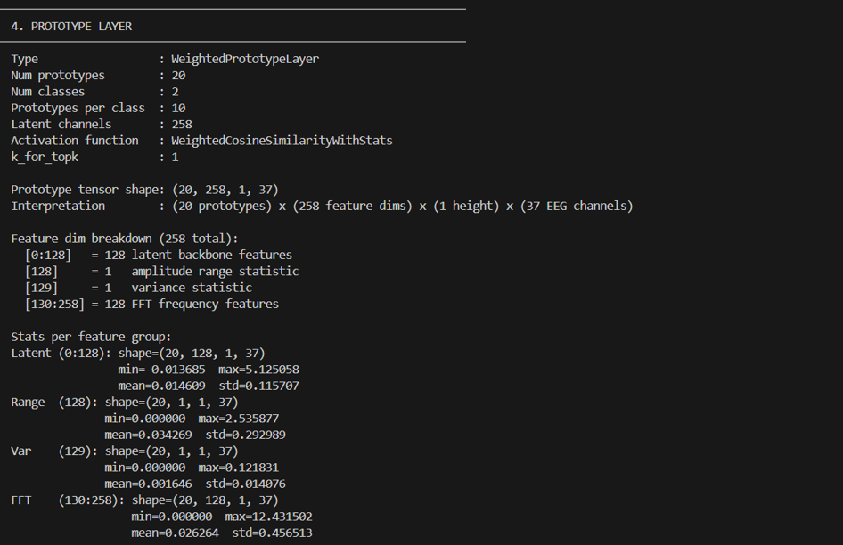
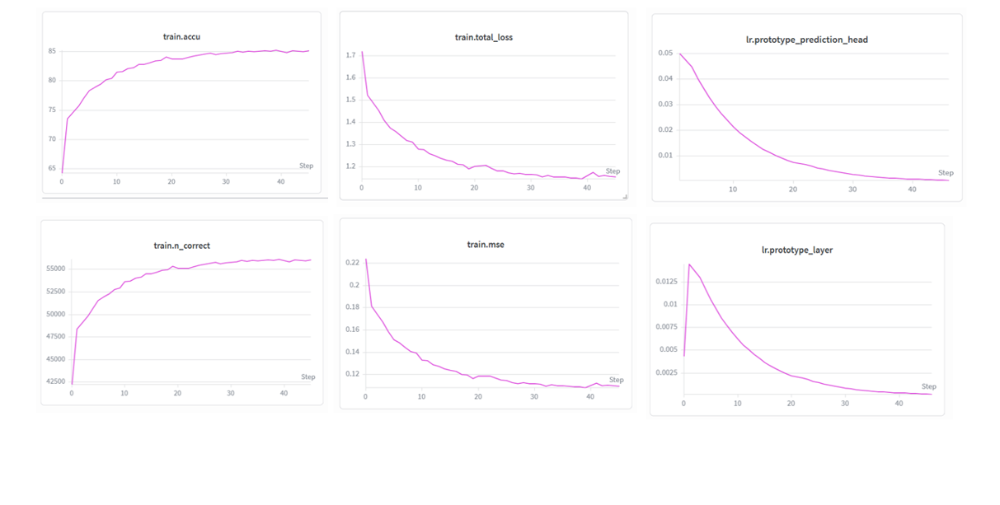
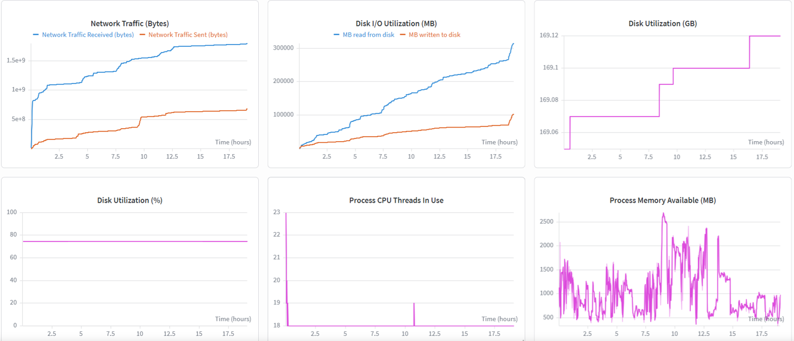
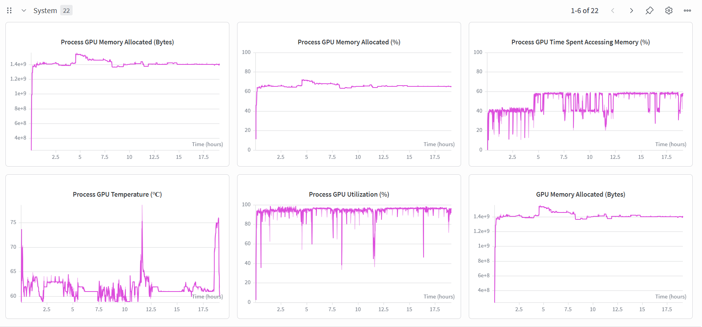

# ProtoEEG-kNN (Backend)

If you’ve ever looked at EEG data, you know that finding IEDs (spikes) is like finding a needle in a haystack. Even senior neurologists often disagree on whether a wave is a real spike or just background noise.

Most AI models try to help, but they are **black boxes** — they give a prediction but don’t explain why. Doctors, quite rightly, don’t trust a machine’s "Yes/No" when it comes to epilepsy diagnosis.

---

## 🧠 Core Idea

This project fixes that using **Case-Based Reasoning**.

Instead of just giving a probability score, the model says:

> “This looks like a spike because it is similar to these 10 historical cases.”

---

## How it reasons

### 1. Morphology (Shape)
The model captures the actual structure of the EEG waveform (latent features).

### 2. Spatial Distribution (Location)
Unlike older models that use one channel, this looks at the whole head using **channel masking**.

### 3. Interpretable Stats (ISFs)
Instead of only deep features, we explicitly include:
- Range
- Variance
- FFT features

### 4. kNN Matching
We embed EEG signals into a feature space and use **k-Nearest Neighbors** to retrieve similar cases, even for rare spikes.

---

# 1. Prerequisite: Environment

We used **Python 3.9.13**. Please stick to this version.

---

## Setting up virtual environment

```powershell
cd ProtoEEG
python -m venv venv

# Activate (Windows)
.\venv\Scripts\Activate.ps1
```

---

## Installing dependencies

```powershell
pip install -r requirements.txt
pip install -r spikenet_requirements.txt
```

---

## Important: PyTorch CUDA fix

If using GPU (recommended), install CU117 build:

```powershell
pip uninstall -y torch torchvision torchaudio

pip install --index-url https://download.pytorch.org/whl/cu117 `
torch==1.13.1+cu117 `
torchvision==0.14.1+cu117 `
torchaudio==0.13.1
```

---

# 2. Required Data Files

Large files are not included in Git.

| Path | File | Description |
|------|------|-------------|
| `../sn2_data/organized_data/` | `train_dict.pth` | EEG datasets |
| `ProtoEEG/models/` | `trained_model.pth` | Model weights |
| `ProtoEEG/model_feats/` | `spikenet_labels.pth` | Channel weights |
| `ProtoEEG/sample_data/` | `sample_data.pth` | Demo data |

---

# 3. Data Preparation (NMT Dataset)

```powershell
python nmt_to_proto.py `
  --edf-dir "E:\NMT-Events\Data\raw_data\edf\Abnormal EDF Files" `
  --csv-dir "E:\NMT-Events\Data\raw_data\csv\SW & SSW CSV Files" `
  --output-dir "..\sn2_data\organized_data" `
  --target-fs 128 `
  --window-samples 192 `
  --step-samples 192 `
  --train-ratio 0.8 `
  --val-ratio 0.1 `
  --normal-keep-prob 0.2
```

---





# 4. Running the Code

## SpikeNet Labels

```powershell
python create_spikenet_labels.py
```

---

## Local Analysis

```powershell
python viz_local_analysis.py
```

---

## Evaluation

```powershell
python eval_eegprotopnet.py -path ./models/trained_model.pth -topk 10
```

---

# 5. Training + Sweeps

```powershell
python start_train.py
```

---









## W&B Sweep

```powershell
$env:PYTHONPATH = "."
$env:WANDB_PROJECT = "PROTOEEG"
$env:WANDB_ENTITY = "faiqqazi73-nust"

wandb sweep training/sweeps/MICCAI/best_normal.yaml
```

---

## Run sweep agent

```powershell
$env:WANDB_SWEEP_ID = "ays6zlip"
python training/sweeps/sweep-eeg.py
```

---

# Notes

- Check CUDA matches PyTorch version
- Ensure GPU is available:
```python
import torch
print(torch.cuda.is_available())
```

- Avoid long Windows paths with spaces
- Keep dataset paths consistent

---