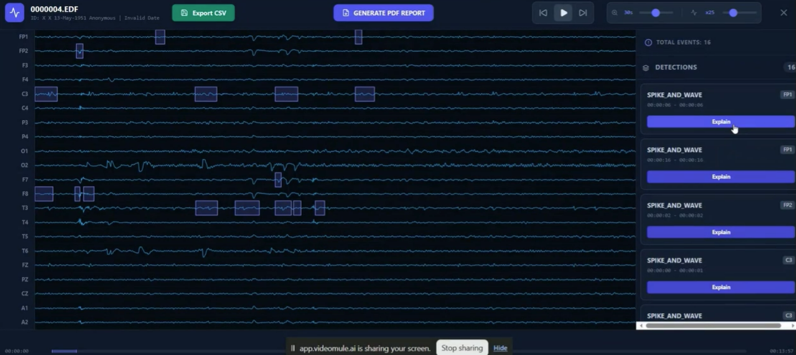
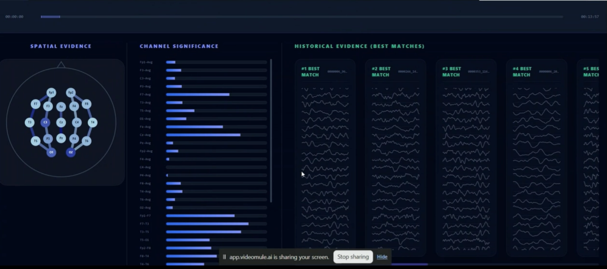

# NeuroXplain - Frontend 

Hi! This is the frontend part of **NeuroXplain**.

Basically, it’s a React-based web application designed to help doctors and researchers visualize EEG signals (from `.edf` files) and get AI-powered explanations for abnormalities like spikes or seizures.

We used **Vite** as the build tool because it's lightweight and very fast during development, and **D3.js** for waveform rendering so the EEG signals stay smooth even while scrolling through large recordings.

---

# What This Tool Does

## 🧠 EDF Parsing

No conversion needed.

Just upload the `.edf` file directly and the app parses it locally in the browser.

---

## 🤖 AI Analysis

The frontend sends EEG segments to the backend (**WAVESAGE model**) to detect:
- epileptic spikes
- seizures
- abnormal EEG activity

---

## 🗺️ Spatial Evidence

The app generates a **Topoplot (head map)** showing where the abnormal activity is occurring spatially across EEG channels.

---

## 🔍 Explainable AI (XAI)

Instead of only saying:

> "Abnormal"

the system also shows:
- similar historical EEG examples
- nearest-neighbor evidence
- visual comparisons

so clinicians can understand *why* the prediction was made.

---

## 📄 PDF Report Generation

After reviewing the EEG, users can generate a clinical report.

The report generation uses the **Gemini API** to automatically summarize findings into readable text.







# Tech Stack

- **React + TypeScript** → frontend UI logic
- **Tailwind CSS** → dark themed styling
- **D3.js** → EEG waveform rendering
- **Lucide React** → icons
- **jsPDF** → PDF report generation

---

# Getting Started

Before starting, make sure you have **Node.js** installed.

---

## 1. Clone the Repository

```bash
git clone <repo-url>
```

Or simply copy the frontend files into a folder.

---

## 2. Open Terminal Inside Frontend Directory

```bash
cd frontend
```

---

## 3. Install Dependencies

```bash
npm install
```

---

## 4. Start Development Server

```bash
npm run dev
```

---

## 5. Open in Browser

Usually Vite runs on:

```text
http://localhost:5173
```

---

# Important Notes (Please Read)

## ⚠️ Backend URLs

Inside:

```text
src/App.tsx
src/components/EEGViewer.tsx
```

you’ll find some **Ngrok URLs** like:

```text
https://2892-34-123-54-156.ngrok-free.app
```

These point to the Python/Colab backend.

If you are running your own backend locally or on another server, you **must update these URLs**, otherwise:
- `Initialize XAI`
- `Explain`

buttons will fail.

---

## ⚠️ Gemini API Key

PDF report generation uses a Gemini API key.

A testing key is currently present in:

```text
src/utils/ReportGenerator.ts
```

If the quota finishes or the key stops working, replace it with your own API key from:

```text
Google AI Studio
```

---

## ⚠️ Large EDF Files

Some EDF recordings can be extremely large.

Since parsing happens directly inside browser memory:
- initial loading may take a few seconds
- browser RAM usage may increase temporarily

Please be patient during parsing.

---

# How to Use the EEG Viewer

---

## 1. Upload an EDF File

Drag and drop your `.edf` file into the upload section.

---

## 2. Wait for AI Analysis

The backend automatically scans roughly the first 20 seconds to detect candidate abnormal events.

---

## 3. Navigate the Signal

You can:
- press `Spacebar`
- or use the `Play` button

to move through the EEG recording.

### Controls Available

Top-right sliders allow changing:

| Control | Function |
|---|---|
| Time Scale | How many seconds are visible |
| Amplitude | How tall the EEG waves appear |

---

## 4. Explain Detected Events

Click any event from the right sidebar and press:

```text
Explain
```

This opens:
- XAI explanation
- nearest-neighbor evidence
- Topoplot visualization
- historical comparisons

---

## 5. Manual Tagging

If the AI misses an event:

- click and drag directly on the waveform
- manually mark EEG regions
- trigger analysis on selected areas

---

# Contributing

If you find:
- EDF parsing bugs
- montage compatibility issues
- rendering glitches
- performance bottlenecks

feel free to:
- open an issue
- submit a PR
- or directly patch the problem

Contributions are always welcome.

---

# Final Notes

This project was built mainly for:
- interpretable EEG analysis
- clinical usability
- explainable AI research
- real-time EEG interaction in the browser

---

# Happy Coding ❤️

Made with ❤️ by the **NeuroXplain Team**